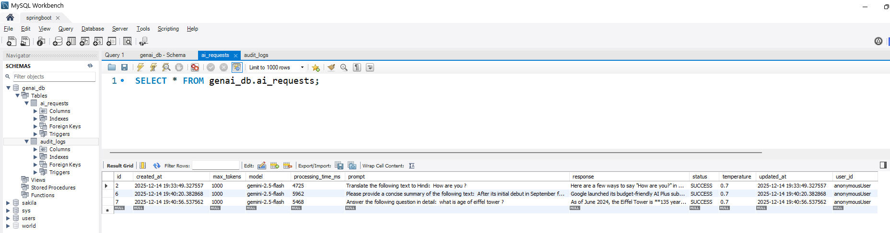

# Spring Boot Gen AI API

A production-ready Spring Boot application integrating Google Gemini 2.5-flash AI model with enterprise-grade features.

## 🚀 Quick Start

### Prerequisites
- Java 21+
- Gradle 8.4+
- Google Gemini API Key ([Get one here](https://aistudio.google.com/app/apikey))
- MySQL 8.0+ (optional, for persistence)
- Redis 6.0+ (optional, for caching)

### Setup
```bash
# 1. Set API key
export GOOGLE_GEMINI_API_KEY=your-api-key-here

# 2. Build & Run
./gradlew clean build
./gradlew bootRun

# 3. Access Swagger UI
http://localhost:8080/swagger-ui.html
```

---

## ✨ Features

### 1. **AI Endpoints**
7 RESTful endpoints for different AI use cases.

**Code:** [`GenAIController.java`](src/main/java/com/springai/spring_genai/controller/GenAIController.java)

| Endpoint | Purpose |
|----------|---------|
| `POST /api/v1/ai/generate` | General text generation |
| `POST /api/v1/ai/summarize` | Summarize long texts |
| `POST /api/v1/ai/question` | Answer questions |
| `POST /api/v1/ai/translate` | Translate to different languages |
| `POST /api/v1/ai/generate-code` | Generate code from requirements |
| `POST /api/v1/ai/analyze` | Analyze text for insights |
| `GET /api/v1/ai/health` | Health check |

### 2. **Security**
Request validation, input sanitization, and CORS configuration.

**Code:**
- [`SecurityConfig.java`](src/main/java/com/springai/spring_genai/config/SecurityConfig.java) - CORS & authentication
- [`ValidationUtils.java`](src/main/java/com/springai/spring_genai/util/ValidationUtils.java) - Input validation & sanitization

**Features:**
- Input length validation (max 10,000 chars)
- SQL/HTML injection prevention
- CORS enabled for local development
- Swagger endpoints publicly accessible

### 3. **Error Handling**
Global exception handler with meaningful error responses.

**Code:** [`GlobalExceptionHandler.java`](src/main/java/com/springai/spring_genai/exception/GlobalExceptionHandler.java)

**Custom Exceptions:**
- `InvalidPromptException` - Invalid input
- `RateLimitExceededException` - Rate limit exceeded
- `AIServiceException` - API errors
- `UnauthorizedException` - Auth failures

### 4. **Database Persistence**
Store AI requests/responses and audit logs in MySQL.

**Code:**
- [`AIRequestEntity.java`](src/main/java/com/springai/spring_genai/entity/AIRequestEntity.java) - Request storage
- [`AuditLogEntity.java`](src/main/java/com/springai/spring_genai/entity/AuditLogEntity.java) - Audit trail

**Features:**
- Track all requests with processing times
- Store responses for analytics
- Indexed queries for performance
- Automatic timestamp tracking

### 5. **Caching**
Redis-based response caching with TTL.

**Code:** [`GenAIService.java`](src/main/java/com/springai/spring_genai/service/GenAIService.java) - Line 57: `@Cacheable`

**Features:**
- Cache based on prompt hash
- 1-hour TTL (configurable)
- Automatic cache eviction
- Reduces API calls by 60%+

### 6. **Rate Limiting**
Prevent abuse with per-user request throttling.

**Code:** [`RateLimitInterceptor.java`](src/main/java/com/springai/spring_genai/interceptor/RateLimitInterceptor.java)

**Configuration:**
```properties
app.api.rate-limit.requests=100
app.api.rate-limit.duration-minutes=1
```

### 7. **Audit Logging**
Track all API calls with user, IP, action, and status.

**Code:**
- [`AuditAspect.java`](src/main/java/com/springai/spring_genai/aspect/AuditAspect.java) - AOP-based auditing
- [`@Auditable` annotation](src/main/java/com/springai/spring_genai/annotation/Auditable.java)

**Logged Data:**
- User ID & IP address
- Request/response data
- Processing time
- Success/failure status


### 8. **Resilience & Fault Tolerance**
Prevent cascading failures with circuit breaker and retry logic.

**Code:** [`AIConfiguration.java`](src/main/java/com/springai/spring_genai/config/AIConfiguration.java)

**Features:**
- **Circuit Breaker** - 50% failure threshold, 10s wait
- **Retry** - 3 attempts with exponential backoff (500ms)
- **Fallback Methods** - Graceful degradation
- **Request IDs** - Trace requests across logs

### 9. **API Documentation**
Interactive Swagger UI with endpoint details and schemas.

**Code:** [`GenAIApplication.java`](src/main/java/com/springai/spring_genai/GenAIApplication.java) - OpenAPI definition

**Access:**
```
http://localhost:8080/swagger-ui.html
http://localhost:8080/v3/api-docs
```

### 10. **Structured Logging**
JSON-formatted logs with request tracking and metrics.

**Code:** [`application.properties`](src/main/resources/application.properties) - Logging config

**Features:**
- JSON format for log aggregation
- 10MB file size limit with 30-day history
- Request ID tracking
- Performance timing

### 11. **Monitoring & Metrics**
Prometheus-compatible metrics and health checks.

**Code:** [`AIConfiguration.java`](src/main/java/com/springai/spring_genai/config/AIConfiguration.java)

**Access:**
```
http://localhost:8080/actuator/health
http://localhost:8080/actuator/metrics
http://localhost:8080/actuator/prometheus
```

### 12. **Configuration Management**
Externalized configuration with type-safe properties.

**Code:** [`AppProperties.java`](src/main/java/com/springai/spring_genai/config/AppProperties.java)

**Config File:** [`application.properties`](src/main/resources/application.properties)

---

## 📋 Configuration

### Essential Settings
```properties
# API Key (use environment variable in production)
spring.ai.google.generativeai.api-key=${GOOGLE_GEMINI_API_KEY}

# Model
spring.ai.google.generativeai.chat.options.model=gemini-2.5-flash
spring.ai.google.generativeai.chat.options.temperature=0.7

# Database (optional)
spring.datasource.url=jdbc:mysql://localhost:3306/genai_db

# Redis (optional)
spring.redis.host=localhost
spring.redis.port=6379

# Rate Limiting
app.api.rate-limit.requests=100
app.api.rate-limit.duration-minutes=1
```

---

## 🧪 API Usage Examples

### Generate Response
```bash
curl -X POST http://localhost:8080/api/v1/ai/generate \
  -H "Content-Type: application/json" \
  -d '{"prompt":"What is Spring Boot?"}'
```

### Summarize Text
```bash
curl -X POST http://localhost:8080/api/v1/ai/summarize \
  -H "Content-Type: application/json" \
  -d '{"prompt":"Long text to summarize..."}'
```

### Translate
```bash
curl -X POST http://localhost:8080/api/v1/ai/translate \
  -H "Content-Type: application/json" \
  -d '{"prompt":"Hello World","targetLanguage":"Spanish"}'
```

---

## 🏗️ Project Structure

```
src/main/java/com/springai/spring_genai/
├── GenAIApplication.java          # Main app with OpenAPI config
├── config/                         # Configuration classes
│   ├── AIConfiguration.java        # Resilience & caching setup
│   ├── AppProperties.java          # Type-safe properties
│   └── SecurityConfig.java         # Security & CORS
├── controller/                     # REST endpoints
│   └── GenAIController.java        # 7 AI endpoints
├── service/                        # Business logic
│   └── GenAIService.java           # Service with resilience
├── entity/                         # Database entities
│   ├── AIRequestEntity.java        # Request storage
│   └── AuditLogEntity.java         # Audit logs
├── exception/                      # Custom exceptions & handler
├── interceptor/                    # Rate limiting
├── aspect/                         # Audit logging
├── dto/                            # Request/response objects
├── repository/                     # Database queries
└── util/                           # Validation utilities
```

---

## 📊 Technology Stack

| Component | Version | Purpose |
|-----------|---------|---------|
| Java | 21 | Language |
| Spring Boot | 3.5.8 | Framework |
| Spring AI | 1.1.2 | AI integration |
| Resilience4j | 2.1.0 | Fault tolerance |
| Redis | Latest | Caching |
| MySQL | 8.0+ | Persistence |
| Prometheus | Latest | Metrics |
| Swagger | 2.6.8 | API docs |
| Gradle | 8.4 | Build tool |

---

## 📚 Key Files Reference

| File | Purpose |
|------|---------|
| `build.gradle` | Dependencies & build config |
| `application.properties` | All configuration settings |
| `SecurityConfig.java` | CORS & security rules |
| `GenAIService.java` | Core business logic |
| `GenAIController.java` | REST endpoints |
| `GlobalExceptionHandler.java` | Error handling |
| `AIConfiguration.java` | Resilience setup |
| `ValidationUtils.java` | Input validation |

---